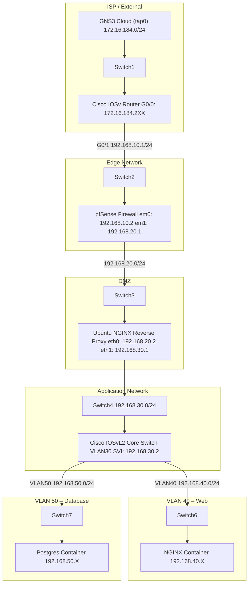

# **ISEC2700 – Mini Project 3 (MP03-00)**

## **Phase 00: GNS3 Environment Setup & Internet Validation**

**Course:** ISEC2700 – Intro to Information Security Practices<br>
**Instructor:** Davis Boudreau<br>
**Type:** Mini-Project (Phase 00 – Foundational Build)<br>
**Weight:** (Suggested 5–10%)<br>
**Mode:** Individual<br>
**Estimated Time:** 3–6 hours<br>
**Due Date:** (Instructor Assigned)<br>

---

## **1. Overview / Purpose / Objectives**

In this phase, students will:

* Build a **multi-layered secure network topology in GNS3**
* Import and deploy enterprise-grade appliances
* Configure **basic connectivity**
* Validate **Internet access via a test browser container**

This phase establishes the **foundation for all security configuration phases** that follow.

---

## **2. Learning Outcomes Addressed**

* LO1 – Identify infrastructure components and trust boundaries
* LO2 – Analyze segmented network architecture
* LO3 – Deploy and validate a functional network baseline

---

## **3. Assignment Description / Use Case**

You are a **Security Analyst** tasked with preparing a secure infrastructure environment for a web application platform.

Before security controls can be implemented, you must:

✔ Build the full topology
✔ Ensure correct addressing
✔ Validate Internet connectivity
✔ Deploy a test client

---

## **4. Task 1 – Create GNS3 Project**

### 🔧 Instructions

1. Connect to your assigned GNS3 server 172.16.184.<deskID> from the SAITGE Labs or via VPN.
2. Launch GNS3 (Web UI or Desktop Client)
3. Click:

```
File → New Blank Project
```

4. Name the project:

```
ISEC2700-MP3
```

5. Click **Create**

---

## **5. Task 2 – Import Appliances (.gns3a Files)**

### 🔧 Instructions

1. Your instructor should provide you all of the necessary appliance files to complete this project.  In GNS3, go to:

```
File → Import Appliance
```

2. Select the provided `.gns3a` file

3. Click **Next**

4. When prompted:

* Choose **Run on GNS3 VM / Remote Server**
* Accept default settings unless instructed otherwise

5. Complete import

---

### ✅ Repeat for ALL appliances if not already imported.  If you have any error during import, please ensure that your instructor has copied the GNS3 images to your:

* Cisco IOSv Router
* Cisco IOSvL2 Switch
* pfSense Firewall
* Ubuntu Server
* Chromium Container
* Debian IP Tools Container
* NGINX Container
* Postgres Container

---

## **6. Task 3 – Build the Topology**

Use the diagram below as your **authoritative build reference**.



---

## **7. Task 4 – Label the Topology (Professional Practice)**

Students must:

---

### 🔧 **Rename ALL devices in GNS3**

| Device       | Naming Standard |
| ------------ | --------------- |
| Router       | ISP-RTR         |
| Firewall     | EDGE-FW         |
| Proxy        | DMZ-PROXY       |
| Core Switch  | CORE-SW         |
| Web Server   | WEB-SRV         |
| Database     | DB-SRV          |
| Test Browser | TEST-CHROME     |

---

### 🔧 **Apply Network Documentation Labels**

Students must also document and label **IP addresses, networks, VLANs, and gateways**.

---

## 🌐 **Network Addressing & Segmentation Table**

| Layer     | Device      | Interface   | IP Address     | Network         | VLAN    | Gateway        |
| --------- | ----------- | ----------- | -------------- | --------------- | ------- | -------------- |
| ISP       | ISP-RTR     | G0/0        | 172.16.184.2XX | 172.16.184.0/24 | N/A     | 172.16.184.250 |
| Transit   | ISP-RTR     | G0/1        | 192.168.10.1   | 192.168.10.0/24 | N/A     | N/A            |
| Transit   | EDGE-FW     | em0         | 192.168.10.2   | 192.168.10.0/24 | N/A     | 192.168.10.1   |
| DMZ       | EDGE-FW     | em1         | 192.168.20.1   | 192.168.20.0/24 | N/A     | N/A            |
| DMZ       | DMZ-PROXY   | eth0        | 192.168.20.2   | 192.168.20.0/24 | N/A     | 192.168.20.1   |
| App Entry | DMZ-PROXY   | eth1        | 192.168.30.1   | 192.168.30.0/24 | VLAN 30 | N/A            |
| App Core  | CORE-SW     | VLAN30 SVI  | 192.168.30.2   | 192.168.30.0/24 | VLAN 30 | 192.168.30.1   |
| Web Tier  | CORE-SW     | VLAN40 SVI  | 192.168.40.1   | 192.168.40.0/24 | VLAN 40 | N/A            |
| Web Tier  | WEB-SRV     | eth0        | 192.168.40.X   | 192.168.40.0/24 | VLAN 40 | 192.168.40.1   |
| DB Tier   | CORE-SW     | VLAN50 SVI  | 192.168.50.1   | 192.168.50.0/24 | VLAN 50 | N/A            |
| DB Tier   | DB-SRV      | eth0        | 192.168.50.X   | 192.168.50.0/24 | VLAN 50 | 192.168.50.1   |
| Test      | TEST-CHROME | eth0 (DHCP) | 172.16.184.X   | 172.16.184.0/24 | N/A     | 172.16.184.250 |

---

## 🧠 **Key Design Notes (Students MUST Understand)**

### 🔹 Network Segmentation

* **192.168.20.0/24 → DMZ**
* **192.168.30.0/24 → Application Entry Layer**
* **192.168.40.0/24 → Web Tier (VLAN 40)**
* **192.168.50.0/24 → Database Tier (VLAN 50)**

---

### 🔹 Default Gateway Flow

| Device         | Gateway                    |
| -------------- | -------------------------- |
| Firewall (WAN) | Router (192.168.10.1)      |
| Proxy          | Firewall (192.168.20.1)    |
| Core Switch    | Proxy (192.168.30.1)       |
| Web Server     | Core Switch (192.168.40.1) |
| Database       | Core Switch (192.168.50.1) |

---

### 🔹 Security Boundaries (Critical Concept)

| Boundary          | Purpose                    |
| ----------------- | -------------------------- |
| ISP → Router      | External entry point       |
| Router → Firewall | First security control     |
| Firewall → DMZ    | Controlled exposure        |
| DMZ → Internal    | Protected internal network |
| VLAN 40 ↔ VLAN 50 | Application isolation      |

---

## **8. Task 5 – Test Internet Access (Chromium Container)**

This is your **validation checkpoint**.

---

### 🔧 Step 1 – Connect Container

* Add **Chromium Container**
* Connect:

```
Chromium eth0 → Switch1
```

---

### 🔧 Step 2 – Configure the Container Network Settings

```
Right-Click and select Configure on the Chromium Container.
```

---

### 🔧 Step 3 – Edit the Container Network Settings

```
Under General settings, Network configuration, click Edit.
```

---

### 🔧 Step 4 – Configure the container network for DHCP

```
Under the section #DHCP config for eth0, un-comment auto eth0, un-comment iface eth0 inet dhcp, and un-comment hostname.  You can also set a unique hostname if your prefer as per your network design.
```

---

### 🔧 Step 5 – Save and Apply Network Configuration settings for the container

```
Click Save, and then Click Ok
```

---

### 🔧 Step 6 – Start the Container

```
Right-click → **Start**
```

---

### 🔧 Step 7 – Launch Browser

```bash
Right-click → **Console** or **Double-Click**
```

---

### 🔧 Step 8 – Validate Internet

Navigate to:

```
http://8.8.8.8
```

✅ If page loads → SUCCESS
❌ If not → troubleshoot DHCP / switch / cloud

---

## **9. Deliverables**

### ✅ Required Submission:

1. **Topology Screenshot (FULL VIEW)**
2. **Device Labels Visible**
3. **Chromium Test Screenshot (8.8.8.8 loaded)**
4. **IP Address Table**

---

## **10. Reflection Questions**

1. Why do we test Internet connectivity before securing the network?
2. What role does the GNS3 Cloud play in this topology?
3. Why is DHCP used for the test container instead of static IP?
4. What would happen if Switch1 was removed?

---

## **11. Assessment Rubric (Suggested)**

| Criteria                   | Marks |
| -------------------------- | ----- |
| Topology Accuracy          | 5     |
| Appliance Deployment       | 5     |
| Labeling & Organization    | 5     |
| Internet Connectivity Test | 5     |
| Documentation              | 5     |

**Total: 25 Marks**

---

## **12. Instructor Notes**

This phase ensures:

* Students can **build environments independently**
* Students understand **network flow before security controls**
* Environment is ready for:

---

## 🔜 **Next Phases Preview**

| Phase   | Focus                   |
| ------- | ----------------------- |
| MP03-01 | Secure ISP Router       |
| MP03-02 | Harden pfSense Firewall |
| MP03-03 | Secure Reverse Proxy    |
| MP03-04 | Secure Core Switch      |
| MP03-05 | Secure Web + Database   |

