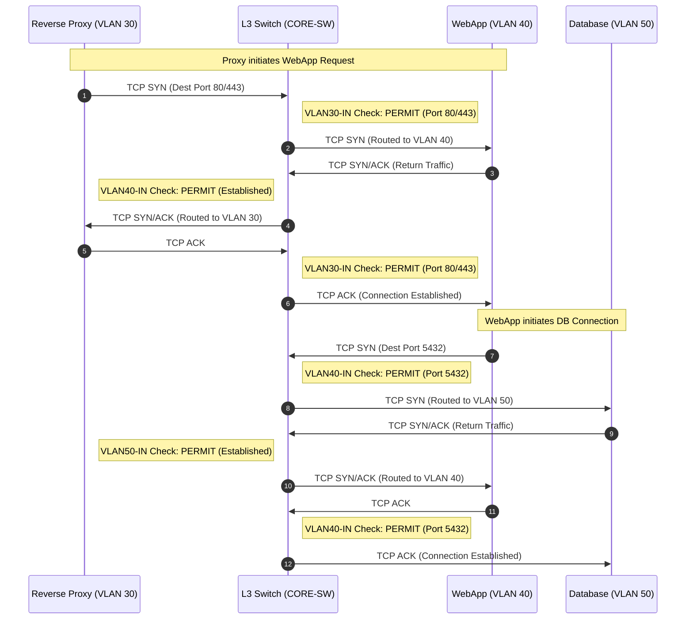

# **ISEC2700 – Mini Project 3 (MP03-04)**

## **Phase 04: Secure Core Switch (VLAN + Segmentation Enforcement)**

**Course:** ISEC2700 – Intro to Information Security Practices<br>
**Instructor:** Davis Boudreau<br>
**Type:** Mini-Project Phase<br>
**Mode:** Individual<br>
**Estimated Time:** 1–2 hours<br>
**Prerequisite:** MP03-03 completed<br>

---

# **1. Overview / Purpose**

In this phase, you will configure the **Core Switch (CORE-SW)** to enforce **layered security between the application tiers** using:

* VLANs
* SVIs
* inter-VLAN routing
* inbound ACLs on each SVI

This phase is one of the most important parts of the project because it teaches you that:

> **Routing allows communication, but ACLs decide whether that communication is permitted.**

By the end of this phase, you will have a switch that:

* allows the **proxy server** in VLAN 30 to access the **web application** in VLAN 40 on **TCP 80 and 443 only**
* allows the **web application** in VLAN 40 to access the **database** in VLAN 50 on **TCP 5432 only**
* blocks all other routed traffic between these networks
* allows only the required **return traffic** using the Cisco `established` keyword

---

# **2. What You Are Building (Security Model)**

## **VLAN Design**

| VLAN    | Purpose                        | Network         | Gateway / SVI |
| ------- | ------------------------------ | --------------- | ------------- |
| VLAN 30 | Proxy / Application Entry Tier | 192.168.30.0/24 | 192.168.30.2  |
| VLAN 40 | Web Application Tier           | 192.168.40.0/24 | 192.168.40.1  |
| VLAN 50 | Database Tier                  | 192.168.50.0/24 | 192.168.50.1  |

---

## **Security Policy**

### Allowed

* VLAN 30 → VLAN 40 on TCP 80 and 443
* VLAN 40 → VLAN 50 on TCP 5432
* return TCP traffic for those permitted sessions

### Blocked

* VLAN 30 → VLAN 50 direct access
* VLAN 30 → anything except web ports on VLAN 40
* VLAN 40 → anything except PostgreSQL to VLAN 50 and return traffic to VLAN 30
* VLAN 50 → anything except return traffic to VLAN 40

---

## **Key Security Principle**

> Each VLAN is its own trust boundary, and each SVI enforces the security policy for traffic entering from that VLAN.

---

# **3. The Big Learning Moment – How the Packets Actually Move**

Before you configure the ACLs, study this sequence carefully.

This is the behavior your switch will enforce.



---

## **Why This Diagram Matters**

This diagram shows three huge ideas:

### **1. The switch is enforcing policy at every routed hop**

Every time traffic enters an SVI, the ACL is checked.

### **2. The first packet of a session must match an explicit permit**

For example:

* Proxy → Web must match port 80 or 443
* Web → DB must match port 5432

### **3. Return traffic is not “magic”**

Return traffic only works because of the `established` rule on the receiving VLAN ACL.

This is the moment students usually realize:

> “Oh — the return traffic is being allowed because the packet has the ACK bit set, not because the switch is truly stateful.”

That is the magic moment.

---

# **4. Key Concepts (Teaching Section)**

## **What is an SVI?**

An SVI, or **Switch Virtual Interface**, is a Layer 3 interface assigned to a VLAN. It gives that VLAN:

* an IP address
* default gateway functionality
* a point where ACLs can be applied

Example:

```cisco
interface vlan 40
 ip address 192.168.40.1 255.255.255.0
```

---

## **What is Inter-VLAN Routing?**

When one VLAN needs to communicate with another VLAN, the Layer 3 switch routes the packet between the SVIs.

Without ACLs:

* everything routable is allowed

With ACLs:

* only explicitly permitted traffic is allowed

---

## **Why Inbound ACLs on Each SVI?**

We apply ACLs **inbound** on each SVI because we want each VLAN to control what traffic is allowed to leave that VLAN and be routed elsewhere.

That means:

* `VLAN30-IN` filters traffic coming from VLAN 30
* `VLAN40-IN` filters traffic coming from VLAN 40
* `VLAN50-IN` filters traffic coming from VLAN 50

---

## **What Does `established` Mean?**

Cisco ACLs are not fully stateful like pfSense, but the `established` keyword helps allow TCP return traffic.

It matches packets that have:

* ACK or RST set

This means:

* new outbound connections still need an explicit permit
* return packets for an existing TCP session can be allowed back

---

## **Why This Is Not Full Stateful Inspection**

A true stateful firewall tracks:

* session state
* sequence behavior
* protocol awareness

The `established` keyword is simpler. It is useful for teaching and works well for this project, but students should know:

> it is a stateless approximation of return traffic handling, not a full firewall state table

---

# **5. Network Reference**

| Device              | Network | IP           |
| ------------------- | ------- | ------------ |
| Proxy Server        | VLAN 30 | 192.168.30.x |
| CORE-SW SVI VLAN 30 | VLAN 30 | 192.168.30.2 |
| WebApp              | VLAN 40 | 192.168.40.2 |
| CORE-SW SVI VLAN 40 | VLAN 40 | 192.168.40.1 |
| Database            | VLAN 50 | 192.168.50.2 |
| CORE-SW SVI VLAN 50 | VLAN 50 | 192.168.50.1 |

---

# **6. Step-by-Step Configuration**

## **Step 1 – Access the Switch**

```cisco
enable
configure terminal
hostname CORE-SW
```

---

## **Step 2 – Create the VLANs**

```cisco
vlan 30
 name PROXY_NET

vlan 40
 name WEB_NET

vlan 50
 name DB_NET
```

---

## **Step 3 – Assign Access Ports**

```cisco
interface g0/0
 switchport mode access
 switchport access vlan 30

interface g0/1
 switchport mode access
 switchport access vlan 40

interface g0/2
 switchport mode access
 switchport access vlan 50
```

---

## **Step 4 – Configure the SVIs**

```cisco
interface Vlan30
 ip address 192.168.30.2 255.255.255.0
 no shutdown

interface Vlan40
 ip address 192.168.40.1 255.255.255.0
 no shutdown

interface Vlan50
 ip address 192.168.50.1 255.255.255.0
 no shutdown
```

---

## **Step 5 – Enable Layer 3 Routing**

```cisco
ip routing
```

---

# **7. Configure the ACLs**

This is the heart of the phase.

---

## **ACL 1 – VLAN30-IN**

This ACL controls traffic initiated by the proxy tier.

It should allow:

* HTTP to VLAN 40
* HTTPS to VLAN 40

It should block:

* everything else routed from VLAN 30

```cisco
ip access-list extended VLAN30-IN
 remark Allow users to initiate HTTP to web/app
 permit tcp 192.168.30.0 0.0.0.255 192.168.40.0 0.0.0.255 eq 80
 remark Allow users to initiate HTTPS to web/app
 permit tcp 192.168.30.0 0.0.0.255 192.168.40.0 0.0.0.255 eq 443
 remark Block all other routed traffic from users
 deny ip 192.168.30.0 0.0.0.255 any
```

Apply it:

```cisco
interface Vlan30
 ip access-group VLAN30-IN in
```

---

## **ACL 2 – VLAN40-IN**

This ACL controls traffic initiated by the web tier.

It should allow:

* return traffic back to VLAN 30 for established web sessions
* PostgreSQL from VLAN 40 to VLAN 50 on TCP 5432

It should block:

* everything else routed from VLAN 40

```cisco
ip access-list extended VLAN40-IN
 remark Allow established return traffic from web/app back to users
 permit tcp 192.168.40.0 0.0.0.255 192.168.30.0 0.0.0.255 established
 remark Allow web/app to initiate PostgreSQL to database
 permit tcp 192.168.40.0 0.0.0.255 192.168.50.0 0.0.0.255 eq 5432
 remark Block all other routed traffic from web/app
 deny ip 192.168.40.0 0.0.0.255 any
```

Apply it:

```cisco
interface Vlan40
 ip access-group VLAN40-IN in
```

---

## **ACL 3 – VLAN50-IN**

This ACL controls traffic initiated by the database tier.

It should allow:

* return traffic back to the web tier for established PostgreSQL sessions

It should block:

* everything else routed from VLAN 50

```cisco
ip access-list extended VLAN50-IN
 remark Allow established return traffic from database back to web/app
 permit tcp 192.168.50.0 0.0.0.255 192.168.40.0 0.0.0.255 established
 remark Block all other routed traffic from database
 deny ip 192.168.50.0 0.0.0.255 any
```

Apply it:

```cisco
interface Vlan50
 ip access-group VLAN50-IN in
```

---

# **8. Save the Configuration**

```cisco
end
copy running-config startup-config
```

---

# **9. Testing Environment Setup**

Use the following tools:

| Tool            | Purpose                                    |
| --------------- | ------------------------------------------ |
| Debian IP Tools | Test HTTP, TCP ports, scans                |
| pgAdmin         | Confirm database access from approved path |

Recommended placement:

* Debian IP Tools on VLAN 30 for user/proxy-side testing
* pgAdmin on VLAN 40 for approved DB testing

---

# **10. Validation Testing**

## **Test 1 – VLAN 30 to Web on HTTP**

From a Debian IP Tools container on VLAN 30:

```bash
curl http://192.168.40.2
```

Expected:

* success

Reason:

* `VLAN30-IN` permits TCP 80 to VLAN 40

---

## **Test 2 – VLAN 30 to Web on HTTPS**

```bash
curl -k https://192.168.40.2
```

Expected:

* success, if HTTPS is configured on the web service

Reason:

* `VLAN30-IN` permits TCP 443 to VLAN 40

---

## **Test 3 – VLAN 30 Directly to Database**

```bash
nc -zv 192.168.50.2 5432
```

Expected:

* blocked

Reason:

* `VLAN30-IN` only allows 80/443 to VLAN 40, then denies everything else

---

## **Test 4 – VLAN 40 to Database on PostgreSQL**

From VLAN 40:

```bash
nc -zv 192.168.50.2 5432
```

Expected:

* success

Reason:

* `VLAN40-IN` permits TCP 5432 to VLAN 50

---

## **Test 5 – VLAN 40 to Database on Any Other Port**

```bash
nc -zv 192.168.50.2 22
```

Expected:

* blocked

Reason:

* `VLAN40-IN` denies all other routed traffic

---

## **Test 6 – Database Initiating a New Connection Back to Web**

From VLAN 50:

```bash
nc -zv 192.168.40.2 80
```

Expected:

* blocked

Reason:

* `VLAN50-IN` only permits established return traffic, not new sessions

---

## **Test 7 – pgAdmin Validation**

From pgAdmin on VLAN 40, try connecting to:

* Host: `192.168.50.2`
* Port: `5432`

Expected:

* success

This confirms:

* the web/app tier can reach the database on the approved application port

---

# **11. Verification Commands**

Run these on the switch:

```cisco
show vlan brief
show ip interface brief
show access-lists
show running-config | section ip access-list
show running-config | section interface Vlan
```

Students should look for:

* VLANs created correctly
* SVIs up/up
* ACLs applied inbound to the correct interfaces
* hit counts increasing on ACL entries during testing

---

# **12. Troubleshooting Guide**

## **Problem: Nothing routes**

Check:

* `ip routing` enabled
* SVI interfaces are up
* end devices have correct default gateways

---

## **Problem: Web access from VLAN 30 fails**

Check:

* web server IP is correct
* VLAN 30 client is using gateway `192.168.30.2`
* ACL `VLAN30-IN` includes port 80/443
* web service is actually listening

---

## **Problem: Database access from VLAN 40 fails**

Check:

* DB server IP is correct
* port 5432 is listening
* ACL `VLAN40-IN` includes 5432
* pgAdmin or test client is actually on VLAN 40

---

## **Problem: Return traffic fails**

Check:

* `established` rules exist on VLAN 40 and VLAN 50
* ACL applied inbound to the correct SVI
* testing is TCP, not ICMP

---

## **Problem: Students think the switch is stateful**

Clarify:

* this is not full stateful inspection
* `established` is only permitting return TCP traffic with ACK/RST
* this is a Layer 3 ACL design, not a next-generation firewall

---

# **13. Deliverables**

Students must submit:

1. screenshot of VLAN configuration
2. screenshot of SVI configuration
3. screenshot of all three ACLs
4. screenshot showing ACLs applied to VLAN 30, 40, and 50
5. screenshot of successful web access from VLAN 30 to VLAN 40
6. screenshot of blocked direct database access from VLAN 30
7. screenshot of successful PostgreSQL access from VLAN 40
8. screenshot of blocked unauthorized traffic from VLAN 50
9. short explanation of:

   * why `established` is required
   * why VLAN 30 cannot directly access VLAN 50
   * why VLAN 50 cannot initiate connections outward

---

# **14. Reflection Questions**

1. Why do we apply ACLs inbound on each SVI instead of only on one interface?
2. Why is `established` necessary for return traffic in this design?
3. Why can VLAN 30 access the web application but not the database?
4. Why is the database allowed to respond but not initiate new sessions?
5. How does this design support a real layered application architecture?

---

# **15. Assessment (Suggested)**

| Criteria                        | Marks |
| ------------------------------- | ----: |
| VLAN and SVI configuration      |     5 |
| ACL creation accuracy           |    10 |
| ACL application to correct SVIs |     5 |
| Validation and testing          |     5 |
| Explanation and documentation   |     5 |

**Total: 30 Marks**

