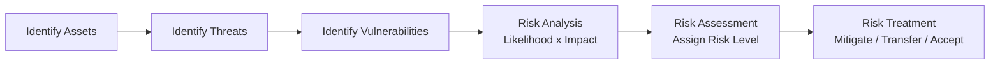
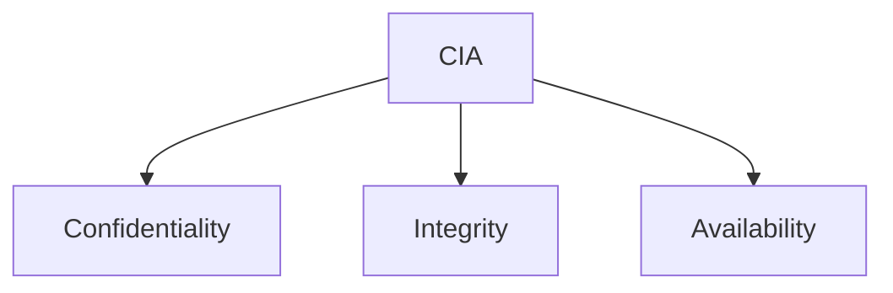
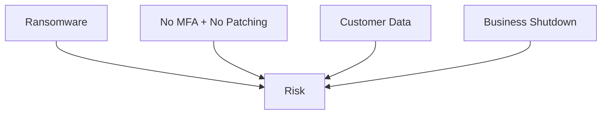
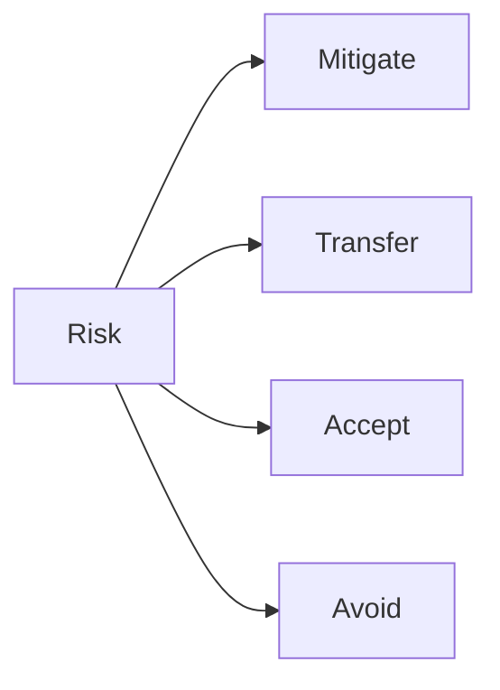

# 🛡️ ISEC2700 – Information Security

# **Mini-Project 1 (MP1): Small Business Security Risk Assessment**

---

# 1️⃣ Assignment Details

| Field            | Information                                   |
| ---------------- | --------------------------------------------- |
| Assignment Title | MP1 – Small Business Security Risk Assessment |
| Course           | ISEC2700 – Information Security               |
| Type             | Individual Mini-Project                       |
| Instructor       | Davis Boudreau                                |
| Weight           | 15%                                           |
| Estimated Effort | 8–10 hours                                    |
| Due              | End of Week X                                 |
| Submission       | PDF Report (Professional Format)              |

---

# 2️⃣ Overview (Read This Carefully)

You have been hired as a **Security Analyst** to conduct a structured security review of a small business.

Your task is to:

* Identify security issues
* Analyze risk
* Assess and prioritize risk
* Recommend mitigation strategies

This project simulates what real security professionals do in consulting environments.

You are not just listing problems.
You are performing a **structured risk assessment**.

---

# 3️⃣ Scenario: MapleTech Accounting Inc.

MapleTech is a small accounting firm with:

* 22 employees
* 1 Windows Server (File + Active Directory)
* 20 Windows 11 desktops
* ISP modem/router (consumer grade)
* Flat network (no VLANs)
* Shared Wi-Fi password
* Microsoft 365 (no MFA enabled)
* Weekly USB backups stored in server room
* No written security policies
* Part-time IT contractor

MapleTech handles:

* Payroll records
* Tax documents
* Customer financial records

This data is highly sensitive.

---

# 4️⃣ Learning Outcomes Addressed

By completing MP1, you will demonstrate that you can:

* Identify security issues in a small business environment
* Apply CIA principles to real environments
* Perform structured risk analysis
* Conduct qualitative risk assessment
* Recommend practical mitigation strategies

---

# 5️⃣ Background: How Security Professionals Think

Before beginning, understand the professional workflow:

You will follow this exact structure.

---

# 6️⃣ Part 1 – Asset Identification (Foundation)

Create an asset inventory table that includes:

* Hardware
* Software
* Network components
* Data assets
* Human assets

Then answer:

* Which assets are critical to Confidentiality?
* Which assets are critical to Integrity?
* Which assets are critical to Availability?

Use the CIA model:

You must demonstrate understanding of CIA — not just define it.

---

# 7️⃣ Part 2 – Identify Security Issues (Minimum 10)

You must identify at least **10 distinct security issues**.

Organize them under domains such as:

* Access Control
* Network Security
* Endpoint Security
* Cloud Security
* Backup & Recovery
* Administrative / Policy

Example format:

| Domain | Security Issue | Why It Is a Problem |
| ------ | -------------- | ------------------- |

Do NOT simply state:

> “No MFA”

Instead explain:

* What threat it enables
* What asset it exposes
* Which CIA principle is impacted

---

# 8️⃣ Part 3 – Risk Analysis

Risk Analysis answers:

> How likely is this?
> How severe is the impact?

Use qualitative scoring:

* Likelihood: Low / Medium / High
* Impact: Low / Medium / High

Example:

Then determine risk using:

Risk = Likelihood × Impact

You must justify each rating.

---

# 9️⃣ Part 4 – Risk Assessment

Now prioritize.

Use this matrix:

| Likelihood | Impact | Risk Level |
| ---------- | ------ | ---------- |
| High       | High   | Critical   |
| High       | Medium | High       |
| Medium     | Medium | Moderate   |
| Low        | Low    | Low        |

You must:

* Rank your top 5 risks
* Explain why they are top priority
* Demonstrate business reasoning

Security is about impact to operations — not just technology.

---

# 🔟 Part 5 – Risk Treatment Recommendations

For your top 5 risks, propose:

* Technical controls
* Administrative controls
* Physical controls (if applicable)

You must choose one of:

* Mitigate
* Transfer
* Accept
* Avoid

Each recommendation must:

* Be realistic for a small business
* Consider cost
* Improve CIA posture

---

# 1️⃣1️⃣ Report Structure (Required Format)

Your submission must contain:

1. Executive Summary (1 page max)
2. Asset Identification
3. Identified Security Issues
4. Risk Analysis Table
5. Risk Assessment Matrix
6. Top 5 Prioritized Risks
7. Risk Treatment Recommendations
8. Reflection (1 page)

Professional formatting is required.

---

# 1️⃣2️⃣ Reflection Section

Answer:

1. Which risk do you believe MapleTech is most likely to ignore?
2. Which mitigation provides the greatest security improvement per dollar?
3. What surprised you during this assessment?
4. How does this exercise relate to real-world cybersecurity work?

---

# 1️⃣3️⃣ Evaluation Rubric (15%)

| Category                         | Marks |
| -------------------------------- | ----- |
| Asset Identification Accuracy    | 2     |
| Security Issue Identification    | 3     |
| Risk Analysis Justification      | 3     |
| Risk Assessment & Prioritization | 3     |
| Mitigation Strategy Quality      | 3     |
| Professional Presentation        | 1     |

---

# 1️⃣4️⃣ What Excellence Looks Like

An excellent submission will:

* Go beyond obvious issues
* Show structured reasoning
* Clearly connect CIA to risks
* Demonstrate business awareness
* Prioritize realistically

A weak submission will:

* List issues without explanation
* Fail to justify likelihood or impact
* Show no prioritization logic

---

# 1️⃣5️⃣ How This Connects to Future Learning

This MP1 prepares you for:

* Security architecture design
* Incident response planning
* Governance & compliance
* Capstone risk modeling

This is foundational cybersecurity thinking.

---

# 🎯 Final Reminder

Security professionals do not guess.

They follow a structured process.

You are being evaluated on:

* Critical thinking
* Structured methodology
* Professional communication
* Realistic security reasoning

