# 🛡️ ISEC2700 – MP1 Investigation Lab

# **Instructor Key: Hidden Vulnerabilities (MapleTech Architecture)**

This document lists **embedded vulnerabilities intentionally designed into the MapleTech environment**.

Students are expected to discover **at least 15–20 issues** during their investigation.

---

# 1. Perimeter Security Vulnerabilities

These issues exist at the **network boundary** between the internet and MapleTech infrastructure.

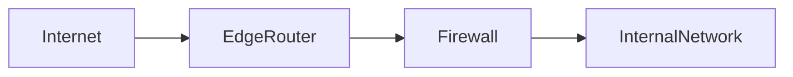

| # | Vulnerability                                    | Security Risk                 |
| - | ------------------------------------------------ | ----------------------------- |
| 1 | Consumer-grade edge router                       | Limited security controls     |
| 2 | Router firmware not regularly updated            | Vulnerable to exploits        |
| 3 | No IDS/IPS at perimeter                          | Attacks not detected          |
| 4 | Firewall rule set overly permissive              | Unnecessary exposure          |
| 5 | No outbound traffic filtering                    | Malware exfiltration possible |
| 6 | No geo-blocking or threat intelligence filtering | Increased attack surface      |

---

# 2. Remote Access Vulnerabilities

MapleTech allows **Remote Desktop access from the internet**.

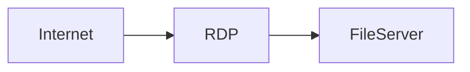

| #  | Vulnerability                     | Security Risk                   |
| -- | --------------------------------- | ------------------------------- |
| 7  | RDP exposed to the internet       | Common ransomware attack vector |
| 8  | No VPN required for remote access | Direct exposure                 |
| 9  | No multi-factor authentication    | Credential theft risk           |
| 10 | Weak password policy              | Brute force risk                |

---

# 3. DMZ Security Weaknesses

The DMZ contains systems exposed to external networks.

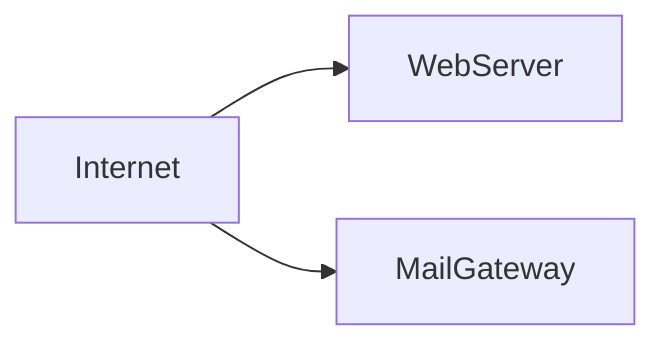

| #  | Vulnerability                                 | Security Risk              |
| -- | --------------------------------------------- | -------------------------- |
| 11 | Web server not isolated from internal network | Potential lateral movement |
| 12 | No Web Application Firewall (WAF)             | Vulnerable to web attacks  |
| 13 | Mail gateway not sandboxing attachments       | Malware delivery risk      |
| 14 | No DMZ monitoring or logging                  | Attacks go unnoticed       |

---

# 4. Network Architecture Vulnerabilities

The internal network architecture contains multiple weaknesses.

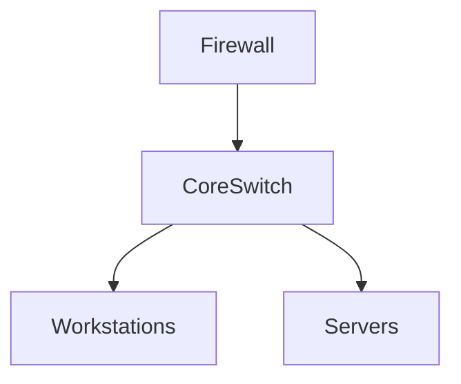

| #  | Vulnerability                                | Security Risk                        |
| -- | -------------------------------------------- | ------------------------------------ |
| 15 | Flat internal network                        | Easy lateral movement                |
| 16 | No VLAN segmentation                         | Workstations access servers directly |
| 17 | No network access control (NAC)              | Rogue devices allowed                |
| 18 | No internal intrusion detection              | Internal attacks invisible           |
| 19 | Printer connected to same network as servers | Potential pivot point                |

---

# 5. Wireless Network Vulnerabilities

The wireless infrastructure introduces additional attack surfaces.

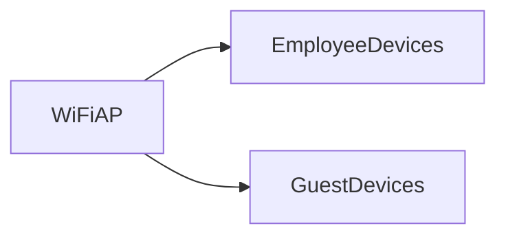

| #  | Vulnerability                             | Security Risk                |
| -- | ----------------------------------------- | ---------------------------- |
| 20 | Guest Wi-Fi connected to internal network | Unauthorized access risk     |
| 21 | Shared Wi-Fi password                     | No accountability            |
| 22 | No device authentication                  | Unknown devices connect      |
| 23 | No wireless network monitoring            | Rogue access points possible |

---

# 6. Identity and Access Control Weaknesses

Identity systems control authentication across the organization.

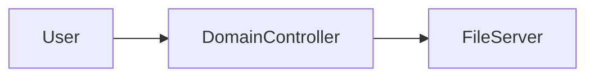

| #  | Vulnerability                     | Security Risk          |
| -- | --------------------------------- | ---------------------- |
| 24 | No MFA for Microsoft 365 accounts | Account takeover risk  |
| 25 | Shared administrative credentials | Lack of accountability |
| 26 | Excessive user privileges         | Insider threat         |
| 27 | No account lockout policy         | Brute force attacks    |
| 28 | No privileged access management   | Admin abuse risk       |

---

# 7. Endpoint Security Issues

Workstations represent a major attack entry point.

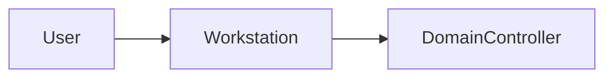

| #  | Vulnerability                      | Security Risk               |
| -- | ---------------------------------- | --------------------------- |
| 29 | No centralized endpoint protection | Malware spread              |
| 30 | No patch management process        | Exploitable vulnerabilities |
| 31 | No disk encryption on laptops      | Data theft risk             |
| 32 | Users allowed local admin rights   | Malware installation risk   |

---

# 8. Data Protection Weaknesses

Sensitive business data requires strong protections.

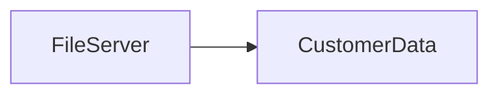

| #  | Vulnerability                 | Security Risk            |
| -- | ----------------------------- | ------------------------ |
| 33 | No data classification policy | Sensitive data unmanaged |
| 34 | File shares overly permissive | Data leakage             |
| 35 | No file access monitoring     | Data theft undetected    |
| 36 | Sensitive data not encrypted  | Confidentiality breach   |

---

# 9. Backup and Recovery Risks

Backups protect against ransomware and disasters.

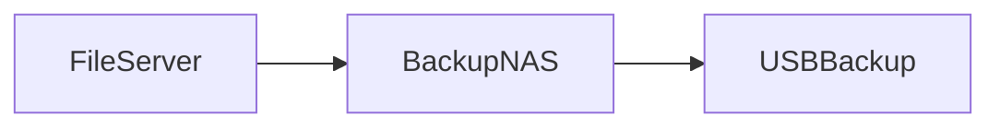

| #  | Vulnerability                  | Security Risk                |
| -- | ------------------------------ | ---------------------------- |
| 37 | Backups stored on same network | Ransomware encryption        |
| 38 | USB backups stored onsite      | Disaster loss                |
| 39 | No backup testing              | Recovery failure             |
| 40 | No immutable backups           | Attackers can delete backups |

---

# 10. Security Monitoring and Operations Gaps

Security operations are required for detection and response.

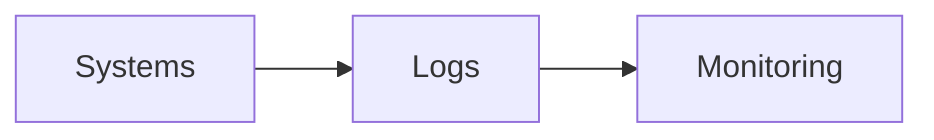

| #  | Vulnerability                           | Security Risk        |
| -- | --------------------------------------- | -------------------- |
| 41 | No centralized logging                  | Incidents undetected |
| 42 | No SIEM or log analysis                 | Delayed response     |
| 43 | No incident response plan               | Chaos during breach  |
| 44 | No employee security awareness training | Phishing success     |

---

# 11. Example Attack Chain (Instructor Discussion)

This chain illustrates how multiple weaknesses combine into a real attack.

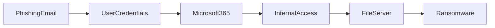

Because:

* no MFA
* flat network
* weak monitoring

an attacker could compromise the entire company.

---

# 12. Instructor Guidance

Students should realistically identify:

**Minimum expected findings**

| Level     | Issues Identified |
| --------- | ----------------- |
| Basic     | 10–12             |
| Competent | 15–20             |
| Excellent | 20–25+            |

Students rarely find all 40 issues — and they shouldn't need to.

The goal is to develop **systematic investigation skills**.

---

# 13. Debrief Strategy for Class

After the investigation, walk students through architecture layers.

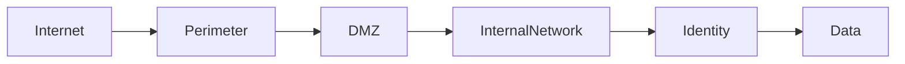

Ask students:

* Which layer had the most weaknesses?
* Which issue created the largest business risk?
* Which issue was easiest to fix?

This discussion reinforces **risk prioritization**.

---

# 14. Key Teaching Insight

This lab works well because students learn that:

> Security failures are rarely caused by a single vulnerability.

They occur due to **multiple small weaknesses across architecture layers**.

---
