# 🛡️ ISEC2700 – Information Security

# **MP1 Foundations: Identifying Security Issues in a Small Business Environment**

---

# 1. Conceptual Explanation

Before security professionals can protect an organization, they must first **understand what can go wrong**.

This process is called **security risk identification**.

Security issues do not exist in isolation. They exist because:

* systems store **valuable assets**
* attackers attempt to exploit **vulnerabilities**
* threats can cause **damage to business operations**

The goal of security analysis is to systematically identify weaknesses that could lead to a **confidentiality, integrity, or availability failure**.

This concept is grounded in the **CIA Triad**.

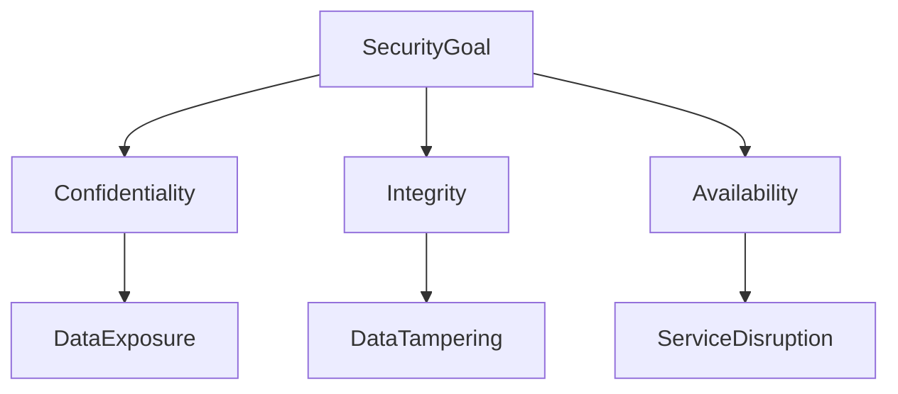

Understanding CIA allows analysts to answer the critical question:

> *What security property is at risk if this system fails?*

---

# 2. Architecture-Level Context

*(How real enterprise environments are structured)*

In professional environments, security issues are identified by analyzing **system architecture layers**.

These layers exist in nearly every enterprise network.

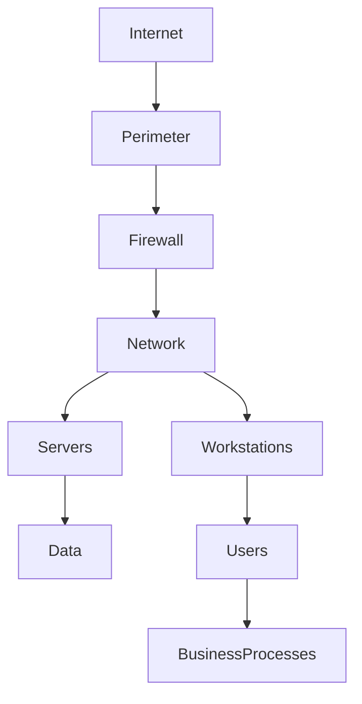

Each layer introduces **different types of security risks**.

| Architecture Layer | Typical Security Issues         |
| ------------------ | ------------------------------- |
| Perimeter          | Firewall misconfiguration       |
| Network            | Flat networks / no segmentation |
| Systems            | Unpatched servers               |
| Identity           | Weak authentication             |
| Data               | Improper access control         |

Security analysts therefore evaluate systems **layer by layer**.

This is known as **defense-in-depth analysis**.

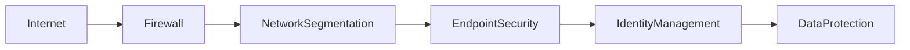

The goal is that **if one control fails, another still protects the organization**.

---

# 3. Understanding Risk in Cybersecurity

Before identifying issues, students must understand the relationship between:

* **Threats**
* **Vulnerabilities**
* **Assets**
* **Impact**

These components form the basis of **risk analysis**.

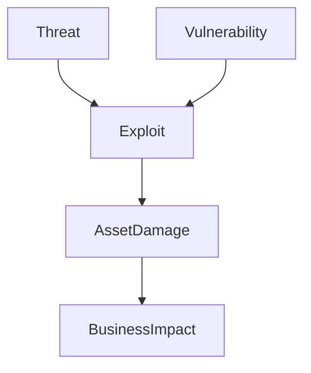

### Definitions

| Component     | Meaning                        |
| ------------- | ------------------------------ |
| Asset         | Something valuable             |
| Threat        | Potential attacker or event    |
| Vulnerability | Weakness that can be exploited |
| Impact        | Damage to the organization     |

Risk is commonly described as:

```
Risk = Threat × Vulnerability × Impact
```

Security professionals must **identify vulnerabilities before attackers do**.

---

# 4. Risk Analysis vs Risk Assessment

Students often confuse these two terms.

They represent **different phases of the security evaluation process**.

### Risk Analysis

Risk Analysis determines:

* how likely an attack is
* how severe the impact could be

### Risk Assessment

Risk Assessment determines:

* how serious the risk is overall
* which risks must be addressed first

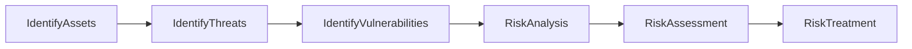

In professional environments, this process is formalized in frameworks such as **ISO 27005** and **NIST Risk Management Framework**.

---

# 5. Step-by-Step Operational Security Analysis

Security analysts follow a systematic methodology.

---

## Step 1 – Identify Assets

Every security investigation begins with understanding **what needs protection**.

Typical assets include:

| Asset Type | Examples              |
| ---------- | --------------------- |
| Hardware   | Servers, laptops      |
| Software   | Business applications |
| Network    | Routers, switches     |
| Data       | Customer records      |
| Human      | Employees             |

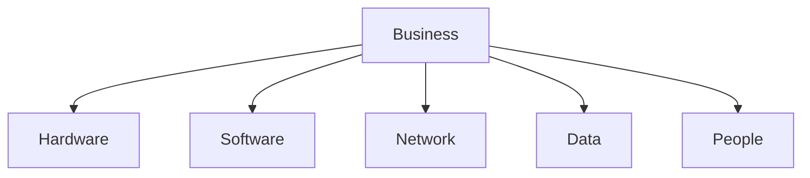

Without understanding assets, security analysis becomes guesswork.

---

## Step 2 – Identify Threats

Threats are events that could damage assets.

Examples include:

* ransomware
* phishing attacks
* insider misuse
* hardware theft

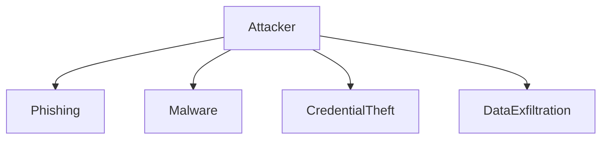

Threat identification helps analysts understand **what attackers are trying to accomplish**.

---

## Step 3 – Identify Vulnerabilities

A vulnerability is a weakness that makes an attack possible.

Examples:

| Vulnerability     | Result                 |
| ----------------- | ---------------------- |
| No MFA            | Account takeover       |
| Unpatched systems | Malware infection      |
| Shared passwords  | Lack of accountability |
| Flat network      | Lateral movement       |

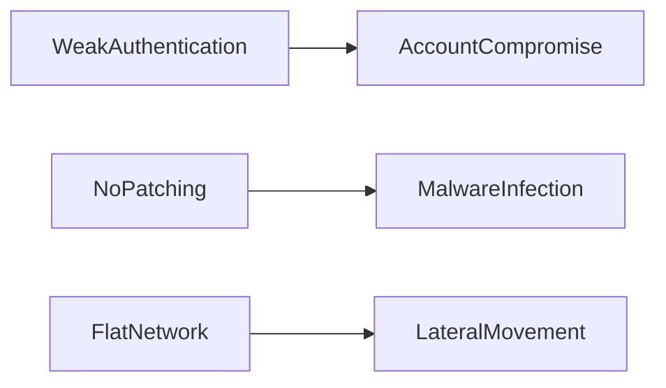

Security analysts look for **misconfigurations, missing controls, and outdated systems**.

---

## Step 4 – Risk Analysis

Risk analysis evaluates **likelihood and impact**.

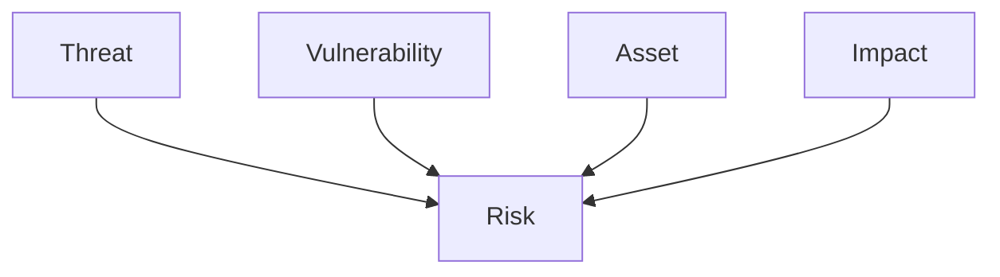

Example:

| Risk       | Likelihood | Impact |
| ---------- | ---------- | ------ |
| Ransomware | High       | High   |
| Data leak  | Medium     | High   |

---

## Step 5 – Risk Assessment

Risk assessment determines **priority levels**.

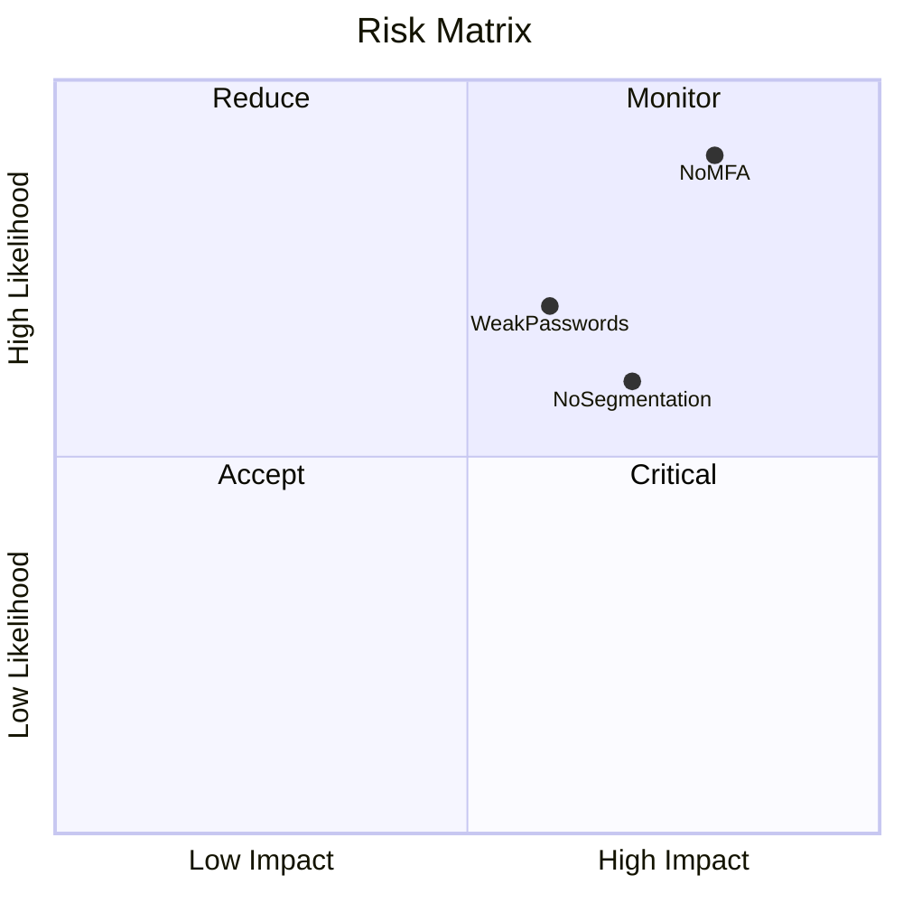

The most critical risks must be addressed first.

---

# 6. Real-World Small Business Scenario

Consider the following environment.

### MapleTech Accounting

* 22 employees
* Windows Server (Active Directory)
* Microsoft 365 (no MFA)
* Shared Wi-Fi password
* Consumer router
* USB backups stored on-site

This environment contains multiple potential security issues.

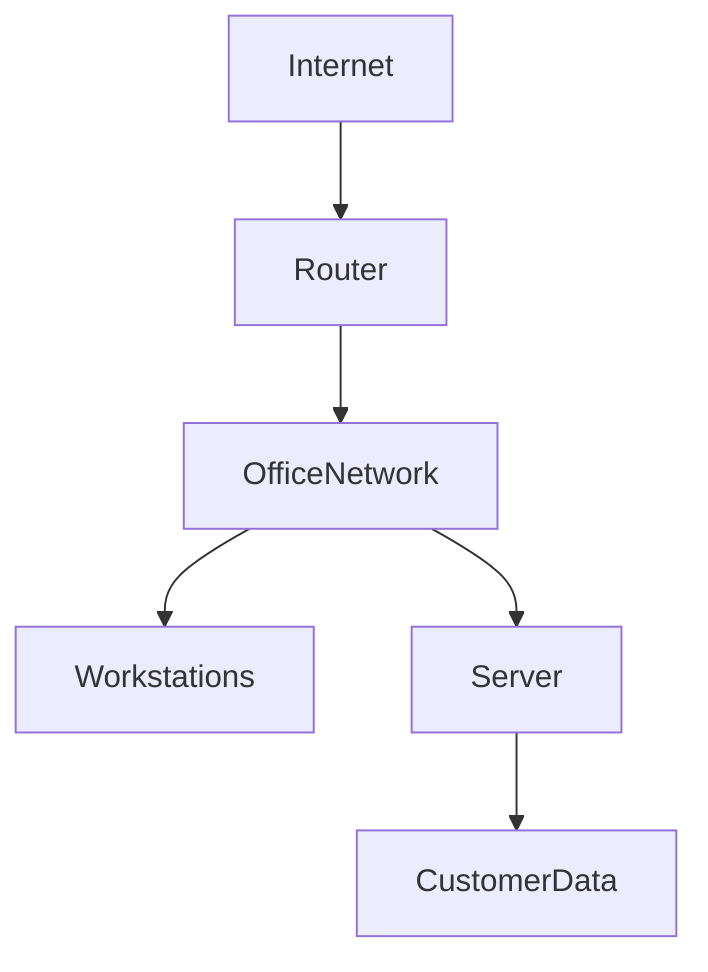

Students must analyze the environment and identify weaknesses.

---

# 7. Real-World Failure Cases

Understanding real incidents helps explain why these issues matter.

---

## Case 1 – Ransomware Attack

Cause:

* Unpatched systems
* No endpoint protection

Outcome:

* File server encrypted
* Business operations halted
* Company forced to pay ransom

---

## Case 2 – Business Email Compromise

Cause:

* No MFA on Microsoft 365

Outcome:

* attacker sends fraudulent invoices
* financial loss occurs

---

## Case 3 – Insider Data Theft

Cause:

* excessive user permissions
* no monitoring

Outcome:

* employee copies customer database

---

# 8. Best Practices and Security Principles

Security professionals follow several guiding principles.

---

## Least Privilege

Users should only have access to what they need.

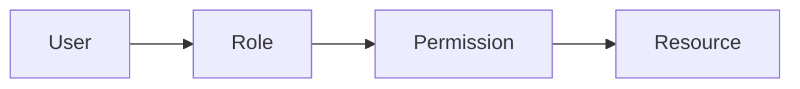

---

## Defense in Depth

Multiple security layers protect systems.

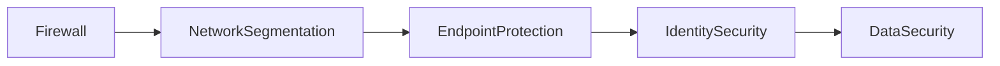

---

## Zero Trust Philosophy

Trust nothing without verification.


---

# 9. Why This Matters for MP1

The purpose of MP1 is **not simply to list vulnerabilities**.

Students must demonstrate that they can:

1. Understand system architecture
2. Identify assets and threats
3. Recognize vulnerabilities
4. Analyze risk logically
5. Prioritize security improvements

This reflects **real cybersecurity analysis workflows used in industry**.

---

# 10. Key Takeaway

Security professionals do not randomly search for problems.

They follow a structured investigation process:

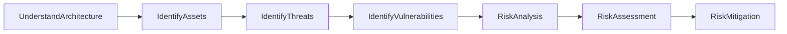

This methodology allows security analysts to identify weaknesses **before attackers exploit them**.

---
