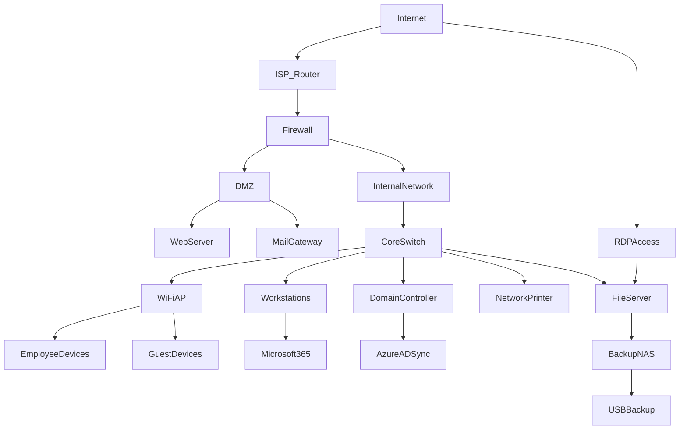

# 🛡️ ISEC2700 – Information Security

# **Mini-Project 1 (MP1): Small Business Security Risk Assessment**

---

# 1. Assignment Details

| Field             | Information                                                    |
| ----------------- | -------------------------------------------------------------- |
| Assignment Title  | Mini-Project 1 (MP1) – Small Business Security Risk Assessment |
| Course Code       | ISEC2700                                                       |
| Course Title      | Information Security                                           |
| Instructor        | Davis Boudreau                                                 |
| Assignment Type   | Security Investigation / Risk Assessment                       |
| Weight            | 15%                                                            |
| Estimated Effort  | 4–6 hours                                                      |
| Delivery Mode     | Individual Investigation                                       |
| Due Date          | See Brightspace                                                |
| Submission Format | Professional Security Assessment Report (PDF)                  |

---

# 2. Overview / Purpose / Objectives

## Overview

In this mini-project, you will conduct a **security investigation of a small business environment** and produce a professional **security risk assessment report**.

You will analyze a fictional organization, **MapleTech Accounting Inc.**, and identify weaknesses within its technology architecture.

Your task is to:

* identify security issues
* analyze risk
* prioritize vulnerabilities
* recommend security improvements

This assignment simulates the work performed by **cybersecurity analysts and security consultants** during an **architecture review and risk assessment engagement**.

---

## Important Preparation

Before beginning this investigation, you **must carefully review the document:**

### **MP1 Foundations: Identifying Security Issues in a Small Business Environment**

That document explains:

* how security professionals identify vulnerabilities
* how risk analysis works
* how risk assessment is performed
* how to analyze systems layer-by-layer

The investigation process introduced in the Foundations document will guide your work in this assignment.

You are expected to **reference the concepts from MP1 Foundations** throughout your report.

---

# 3. Investigation Scenario

You are working as a **Junior Security Analyst** for a cybersecurity consulting firm.

Your team has been hired by **MapleTech Accounting Inc.** to perform a **security architecture review** and identify potential risks in their IT environment.

The organization wants to understand:

* where security weaknesses exist
* which risks are most serious
* which improvements should be prioritized

You will perform an **initial security assessment** using the information provided in this investigation packet.

---

# 4. Organization Profile

**Organization Name:** MapleTech Accounting Inc.
**Industry:** Accounting and Financial Services
**Location:** Halifax Regional Municipality, Nova Scotia
**Employees:** 22
**IT Support:** External part-time contractor

### Business Overview

MapleTech Accounting Inc. provides financial services for small businesses and individuals.

Core services include:

* tax preparation
* bookkeeping
* payroll processing
* financial advisory services

Because MapleTech processes sensitive financial information, protecting data confidentiality and integrity is essential.

---

## Sensitive Data Managed

| Data Type                | Sensitivity |
| ------------------------ | ----------- |
| Tax records              | High        |
| Payroll data             | High        |
| Client financial records | High        |
| Internal accounting data | Medium      |
| Employee HR records      | Medium      |

Security failures could result in:

* financial fraud
* data breaches
* loss of client trust
* operational disruption

---

# 5. Technology Architecture Overview

MapleTech operates a small office network that combines **on-premise systems and cloud services**.

The architecture diagram below represents the current environment.

---

# 6. Technology Inventory

The following infrastructure components exist within the MapleTech environment.

### Network Infrastructure

| System                | Description                   |
| --------------------- | ----------------------------- |
| ISP Router            | Internet connectivity         |
| Firewall              | Basic perimeter protection    |
| Core Switch           | Internal network connectivity |
| Wireless Access Point | Office wireless network       |

---

### Servers

| Server            | Purpose                         |
| ----------------- | ------------------------------- |
| Domain Controller | Active Directory authentication |
| File Server       | Shared document storage         |
| Web Server        | Public company website          |
| Mail Gateway      | Email filtering                 |

---

### End User Devices

| Device Type             | Quantity |
| ----------------------- | -------- |
| Windows 11 Workstations | 20       |
| Laptops                 | 4        |
| Network Printer         | 1        |

---

### Cloud Services

| Service       | Purpose                  |
| ------------- | ------------------------ |
| Microsoft 365 | Email and collaboration  |
| Azure AD Sync | Identity synchronization |

---

# 7. Operational Practices

### User Accounts

Employees are issued:

* an Active Directory account
* a Microsoft 365 account

Authentication currently uses **username and password only**.

Password requirements:

* minimum length: 8 characters
* password expiration: every 180 days

---

### Remote Access

Employees sometimes work remotely.

Remote connectivity is provided through:

* Remote Desktop (RDP)
* direct connection to internal systems

---

### Wireless Access

The office has one wireless network used by:

* employees
* visitors
* contractors

The wireless password is occasionally shared with guests.

---

### Backup Practices

The file server is backed up using the following process:

* daily backups to a **local NAS device**
* weekly backup copied to **USB storage**
* USB storage kept in the server room

---

### Software Updates

Software updates are typically installed:

* when the IT contractor visits
* when users manually install updates

There is no automated patch management system.

---

# 8. Security Controls Currently Implemented

The following controls are currently in place.

| Control              | Status                    |
| -------------------- | ------------------------- |
| Firewall             | Enabled                   |
| Antivirus            | Installed on workstations |
| Windows updates      | Installed periodically    |
| Email spam filtering | Basic filtering           |

---

# 9. Security Policies

MapleTech maintains a limited set of security guidelines.

---

## Acceptable Use

Employees are expected to:

* use company computers for work purposes
* avoid suspicious websites
* report technical issues to the IT contractor

---

## Password Policy

Employees must:

* use at least 8 characters
* change passwords every 180 days
* avoid sharing passwords

---

## Data Storage Policy

Employees are instructed to store files on the **company file server** rather than local computers.

---

## Incident Reporting

Employees should report suspicious emails or system problems to the office manager.

---

# 10. Organizational Constraints

MapleTech has limited IT resources.

Current limitations include:

* no dedicated cybersecurity team
* limited IT budget
* one external IT contractor
* no centralized monitoring systems

The company wants to understand **which security improvements should be prioritized**.

---

# 11. Your Assignment

Using the information in this packet, you must conduct a **security investigation**.

You should follow the **security analysis process introduced in the MP1 Foundations document**.

---

# 12. Investigation Focus Areas

Your investigation should analyze the environment across multiple domains.

| Domain                  | Focus                     |
| ----------------------- | ------------------------- |
| Perimeter Security      | Internet-facing exposure  |
| Network Architecture    | Internal network design   |
| Identity and Access     | Authentication systems    |
| Endpoint Security       | Workstation protection    |
| Data Protection         | File storage and access   |
| Backup and Recovery     | Data resilience           |
| Cloud Security          | Microsoft 365 environment |
| Administrative Controls | Policies and procedures   |

---

# 13. Final Deliverable

You must submit a **Professional Security Risk Assessment Report** that includes:

* Executive Summary
* Architecture Analysis
* Vulnerability Findings
* Risk Analysis
* Risk Matrix
* Top Risk Prioritization
* Remediation Plan

Your report should demonstrate that you understand how to **identify security issues and evaluate risk in a real organizational environment**.

---
