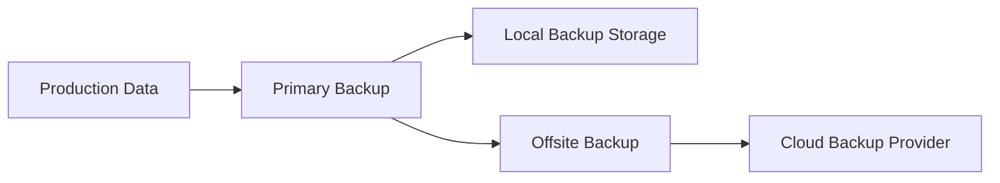
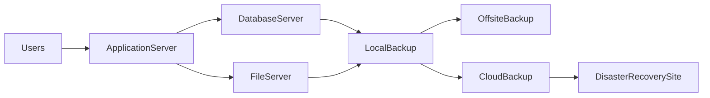
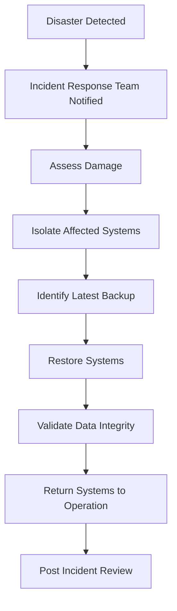

---

# ISEC2700 – Mini-Project 2 (MP2)

# Risk Mitigation: Backup Solutions and Disaster Recovery Planning

---

# 1. Assignment Details

| Field            | Information                                                     |
| ---------------- | --------------------------------------------------------------- |
| Assignment Title | Mini-Project 2 – Risk Mitigation and Disaster Recovery Planning |
| Course Code      | ISEC2700                                                        |
| Course Title     | Information Security                                            |
| Instructor       | Davis Boudreau                                                  |
| Assignment Type  | Security Architecture Project                                   |
| Weight           | 20% (recommended)                                               |
| Estimated Effort | up to 4 hours                                                   |
| Prerequisite     | MP1 – Security Risk Assessment                                  |
| Delivery Mode    | Individual                                                      |
| Submission       | Brightspace + GitHub                                            |
| Due              | See LMS (Brighspace)                                            |

---

# 2. Overview / Purpose / Objectives

## Overview

In **Mini-Project 1**, you performed a **security risk assessment** on a small business environment.
You identified vulnerabilities, evaluated threats, and created a risk matrix.

In **Mini-Project 2**, you will transition from **security analysis to security architecture design**.

Your responsibility is now to ensure that the organization **can recover from disasters and security incidents**.

You will design a **backup architecture and disaster recovery plan** that ensures critical business systems remain available and recoverable.

---

## Purpose

Modern cybersecurity is not only about **preventing attacks**.

Organizations must also be able to **recover quickly when incidents occur**.

Examples include:

• ransomware
• server failure
• data corruption
• accidental deletion
• natural disasters
• cyber attacks

Security professionals must design systems that maintain **operational resilience**.

---

## Objectives

By completing this project, students will learn how to:

• identify **critical business systems**
• design **backup strategies**
• apply the **3-2-1 backup rule**
• define **Recovery Time Objectives (RTO)**
• define **Recovery Point Objectives (RPO)**
• design **disaster recovery procedures**
• build **security architecture diagrams**

---

# 3. Learning Outcomes Addressed

This project supports the **ISEC2700 Security Architecture Model**, particularly the **Protection and Recovery domains**.

Students will demonstrate the ability to:

• analyze critical assets in an information system
• design security controls that mitigate operational risks
• develop disaster recovery strategies
• communicate security architecture using professional documentation and diagrams

---

# 4. Assignment Description / Use Case

You are working as a **Security Architect** for the same company analyzed in **Mini-Project 1**.

Management has reviewed your **risk assessment report** and now wants to know:

> "If something goes wrong, how do we recover?"

Your task is to design a **backup and disaster recovery architecture** that ensures the company can restore critical systems and resume operations.

You must ensure the organization can recover from events such as:

• ransomware infection
• database corruption
• accidental file deletion
• server hardware failure
• building fire or flood
• power outage

---

# 5. Tasks / Instructions

Students must complete the following tasks.

---

# Task 1 – Critical System Identification

Using your **MP1 analysis**, identify the **most important business systems**.

Examples may include:

• database servers
• file storage
• authentication servers
• email systems
• web services
• financial systems

Create a table similar to the following:

| System            | Business Function | Criticality | Impact if Unavailable      |
| ----------------- | ----------------- | ----------- | -------------------------- |
| Customer Database | Order management  | Critical    | Orders cannot be processed |
| File Server       | Design documents  | High        | Production delays          |
| Email Server      | Communication     | Medium      | Internal disruption        |

Explain **why each system is critical**.

---

# Task 2 – Backup Strategy Design

Design a **backup strategy** for each system.

You must consider:

• backup type
• backup frequency
• storage location
• security protections

Example structure:

| System            | Backup Type | Frequency | Storage Location |
| ----------------- | ----------- | --------- | ---------------- |
| Database          | Incremental | Daily     | Cloud            |
| File Server       | Full        | Weekly    | Offsite          |
| Accounting System | Incremental | Daily     | Local + Cloud    |

Students must apply the **3-2-1 Backup Rule**.

### 3-2-1 Backup Model



Explanation:

• **3 copies of data**
• **2 different storage media**
• **1 offsite copy**

---

# Task 3 – Define Recovery Objectives

Students must define **RTO and RPO values**.

| System            | RTO     | RPO        |
| ----------------- | ------- | ---------- |
| Customer Database | 2 hours | 30 minutes |
| File Server       | 8 hours | 24 hours   |
| Email             | 4 hours | 1 hour     |

### Key Concepts

**Recovery Time Objective (RTO)**
Maximum acceptable downtime.

**Recovery Point Objective (RPO)**
Maximum acceptable data loss.

Example:

If RPO = 30 minutes, backups must occur **at least every 30 minutes**.

---

# Task 4 – Backup Architecture Design

Students must design a **backup architecture diagram**.

Example architecture:



Students should label:

• systems
• backup storage
• offsite locations
• disaster recovery environment

---

# Task 5 – Disaster Recovery Plan

Students must design a **step-by-step disaster recovery procedure**.

Example workflow:



Students should describe:

• recovery responsibilities
• recovery steps
• validation procedures

---

# Task 6 – Ransomware Resilience Analysis

Students must explain:

**How does your backup architecture protect against ransomware?**

Consider:

• offline backups
• immutable backups
• backup isolation
• versioned backups
• air-gapped storage

---

# 6. Deliverables

Students must submit the following:

### 1. Disaster Recovery Report (4–6 pages)

Sections:

1. Executive Summary
2. Critical Systems Identification
3. Backup Strategy Design
4. RTO/RPO Analysis
5. Backup Architecture
6. Disaster Recovery Procedures
7. Ransomware Protection Strategy

---

### 2. Architecture Diagram

Students must include:

• backup architecture diagram
• disaster recovery workflow diagram

Mermaid diagrams are acceptable.

---

### 3. Risk Mitigation Summary

Students must link their design to **MP1 risks**.

Example:

| MP1 Risk           | MP2 Mitigation                    |
| ------------------ | --------------------------------- |
| No database backup | Implement hourly snapshot backups |
| Single file server | Add offsite replication           |
| No recovery plan   | Implement DR procedures           |

---

### 4. Reflection

Students must answer:

1. Which system was hardest to protect and why?
2. What risks remain even with your backup strategy?
3. How could ransomware affect your architecture?

---

# 7. Assessment & Rubric

| Criteria                   | Points |
| -------------------------- | ------ |
| Critical system analysis   | 15     |
| Backup strategy design     | 25     |
| RTO/RPO justification      | 15     |
| Architecture diagrams      | 15     |
| Disaster recovery planning | 20     |
| Professional documentation | 10     |

Total: **100 points**

---

# 8. Submission Guidelines

Students must submit:

• Microsoft Word report
• diagrams embedded in report
• GitHub repository link

Repository naming convention:

```
wXXXXXXX-ISEC2700-MP2
```

Students should ensure **no sensitive data is included** in their repository.

---

# 9. Resources / Equipment

Students may reference:

• NIST Disaster Recovery Guidelines
• CIS Backup Recommendations
• Microsoft Backup Documentation
• Cloud provider backup architectures

Students are encouraged to research **real-world backup solutions**.

---

# 10. Academic Policies

All work must be **original**.

Students may collaborate on ideas but must produce **individual submissions**.

Academic integrity policies apply.

---

# 11. Copyright Notice

This assignment is part of the **NSCC Information Technology Program** and is intended for educational purposes.

Students retain ownership of their original work.

---

# Instructor Enhancement (Recommended)

To make this project **exceptionally strong**, we can also add:

### MP2 Student Workbook

Includes:

• backup design worksheets
• RTO/RPO calculation tables
• disaster recovery planning templates

### MP2 Architecture Diagram Pack

• enterprise backup architecture
• ransomware recovery architecture
• disaster recovery site model

### MP2 Instructor Key

• expected mitigation strategies
• common student mistakes
• grading guidance

---

If you'd like, I can also generate a **very powerful visual for this assignment**:

**“Enterprise Backup & Disaster Recovery Architecture Map”**

(a large Mermaid diagram students can reference — similar to the **Security Architecture Brain Diagram you used earlier**).

It becomes one of the **most memorable diagrams in the entire course**.
