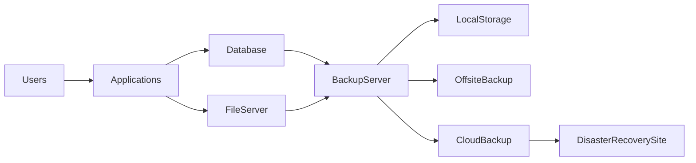
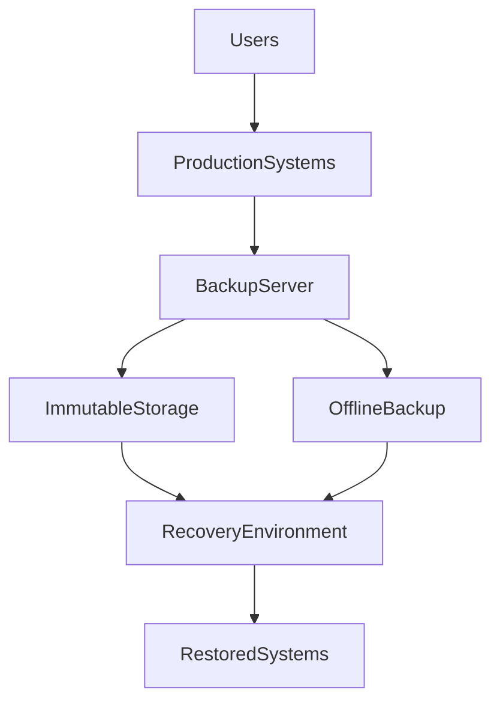
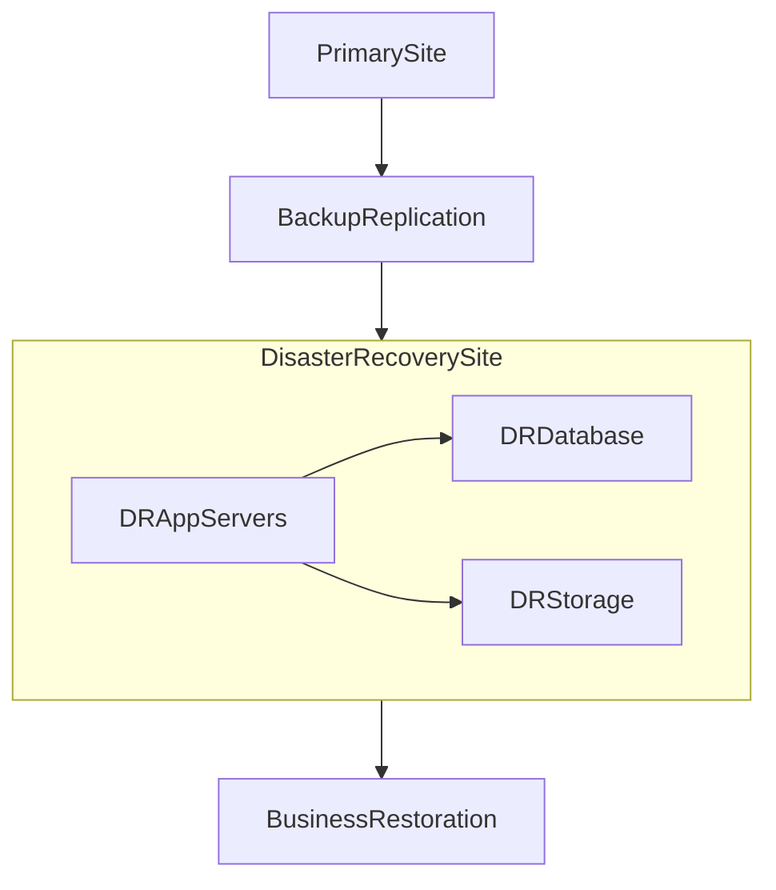

# ISEC2700 – Mini Project 2

# Student Workbook - Instructor Enhancement Package

### Risk Mitigation: Backup Solutions & Disaster Recovery Planning

This package contains three components:

1. **MP2 Student Workbook**
2. **MP2 Architecture Diagram Pack**
3. **MP2 Instructor Expectations**

These materials transform the assignment from a simple report into a **guided architecture design exercise**.

---

# 1. MP2 Student Workbook

The workbook acts as a **structured planning document** that students complete before writing their final report.

Students should **submit this workbook as an appendix** to their MP2 report.

---

# Section 1 — Critical Asset Identification Worksheet

Students must identify **systems essential to business operations**.

| System Name | Function | Data Type | Criticality (Low / Medium / High / Critical) | Business Impact if Lost |
| ----------- | -------- | --------- | -------------------------------------------- | ----------------------- |
|             |          |           |                                              |                         |
|             |          |           |                                              |                         |
|             |          |           |                                              |                         |

### Instructor Notes

Students should recognize:

Critical systems often include:

* databases
* file servers
* authentication systems
* ERP/accounting systems
* application servers

---

# Section 2 — Threat & Failure Scenario Worksheet

Students must identify events that could require recovery.

| Threat Scenario         | Likelihood | Impact   | Systems Affected      |
| ----------------------- | ---------- | -------- | --------------------- |
| Ransomware attack       | High       | Critical | File server, database |
| Server hardware failure | Medium     | High     | Application server    |
| Accidental deletion     | High       | Medium   | File storage          |

Students should connect this to their **MP1 risk assessment**.

---

# Section 3 — Backup Design Worksheet

Students design a backup strategy for each system.

| System | Backup Type | Backup Frequency | Storage Location | Retention Period |
| ------ | ----------- | ---------------- | ---------------- | ---------------- |
|        |             |                  |                  |                  |
|        |             |                  |                  |                  |

### Backup Types

Students should reference:

• Full backups
• Incremental backups
• Differential backups
• Snapshot backups

---

# Section 4 — 3-2-1 Backup Compliance Check

Students must confirm their design meets the **3-2-1 rule**.

| Requirement               | Implementation |
| ------------------------- | -------------- |
| 3 copies of data          |                |
| 2 different storage media |                |
| 1 offsite copy            |                |

---

# Section 5 — RTO/RPO Calculation Table

Students must define acceptable downtime and data loss.

| System | RTO | RPO | Justification |
| ------ | --- | --- | ------------- |
|        |     |     |               |
|        |     |     |               |

### Example

| System            | RTO     | RPO        |
| ----------------- | ------- | ---------- |
| Customer Database | 2 hours | 30 minutes |
| File Server       | 8 hours | 24 hours   |

---

# Section 6 — Disaster Recovery Planning Template

Students must outline recovery steps.

| Step | Action                      | Responsible Role    |
| ---- | --------------------------- | ------------------- |
| 1    | Disaster identified         | IT staff            |
| 2    | Incident response activated | Security team       |
| 3    | Backup restoration begins   | Infrastructure team |
| 4    | Systems verified            | IT operations       |

---

# Section 7 — Ransomware Protection Worksheet

Students must explain how their backup architecture resists ransomware.

| Control           | Implementation |
| ----------------- | -------------- |
| Immutable backups |                |
| Offline backups   |                |
| Backup isolation  |                |
| Versioned storage |                |

---

# 2. MP2 Architecture Diagram Pack

These diagrams provide **visual architecture references** students can analyze or adapt.

---

# Diagram 1 — Enterprise Backup Architecture

---

# Diagram 2 — Ransomware Recovery Architecture

Key teaching point:

**Immutable backups prevent ransomware encryption of backups.**

---

# Diagram 3 — Disaster Recovery Site Model

Students should recognize:

This architecture enables **failover to a secondary site**.

---

# 3. MP2 Instructor Key

This section helps instructors evaluate student work effectively.

---

# Expected Mitigation Strategies

Students should propose solutions such as:

### Backup Strategies

Good answers include:

• daily incremental backups
• weekly full backups
• offsite backup storage
• cloud backup replication

Advanced answers may include:

• immutable storage
• backup encryption
• automated verification
• backup monitoring

---

# Expected RTO/RPO Values

Example expectations:

| System       | Expected RTO | Expected RPO  |
| ------------ | ------------ | ------------- |
| Database     | 1–4 hours    | 15–60 minutes |
| File storage | 4–24 hours   | 24 hours      |
| Email        | 2–8 hours    | 1 hour        |

Students should justify their choices based on **business impact**.

---

# Common Student Mistakes

These appear frequently.

### Mistake 1 — Only One Backup Location

Students often propose:

> “Backup stored on the same server.”

Explain:

This does **not protect against hardware failure or ransomware**.

---

### Mistake 2 — No Offsite Backup

Students forget geographic separation.

Teach:

Backups must survive **site-level disasters**.

---

### Mistake 3 — RTO/RPO Not Justified

Students sometimes write arbitrary numbers.

Good answers should explain:

• business impact
• operational requirements

---

### Mistake 4 — Ignoring Ransomware

Students may design backups that ransomware could encrypt.

Expected protections include:

• immutable backups
• offline backups
• backup isolation

---

# Grading Guidance

Use the following evaluation model.

| Category                   | Evaluation Focus                                     |
| -------------------------- | ---------------------------------------------------- |
| Critical asset analysis    | Did students correctly identify critical systems?    |
| Backup architecture        | Is the design realistic and layered?                 |
| RTO/RPO justification      | Are recovery objectives logical?                     |
| Disaster recovery planning | Are recovery steps structured and clear?             |
| Security thinking          | Did students consider ransomware and data integrity? |

---

# Recommended Instructor Discussion

After grading MP2, conduct a class discussion:

**“What would happen if ransomware encrypted the backups?”**

This question often produces **excellent security architecture thinking**.

---

# Optional Advanced Exercise

Students can analyze a real-world case such as:

**Colonial Pipeline ransomware attack**

Ask:

> Would your backup architecture allow this company to recover quickly?

---
