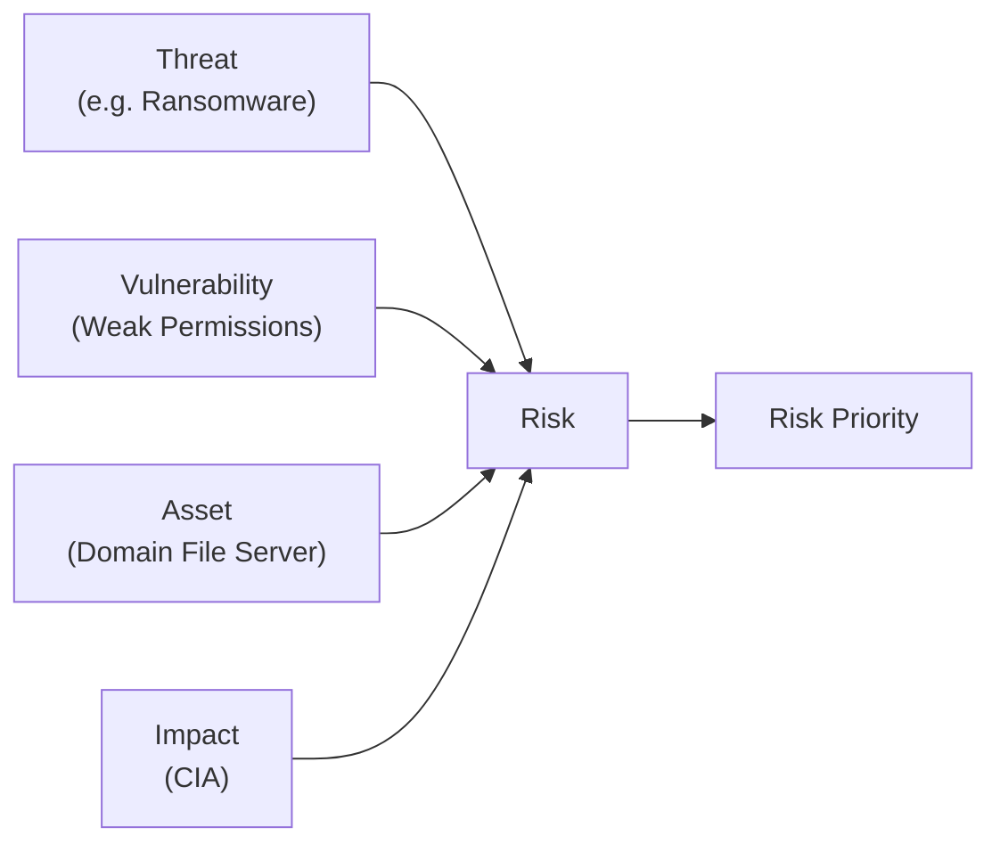
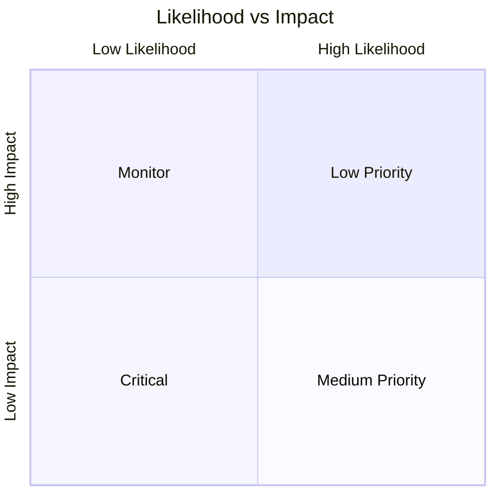
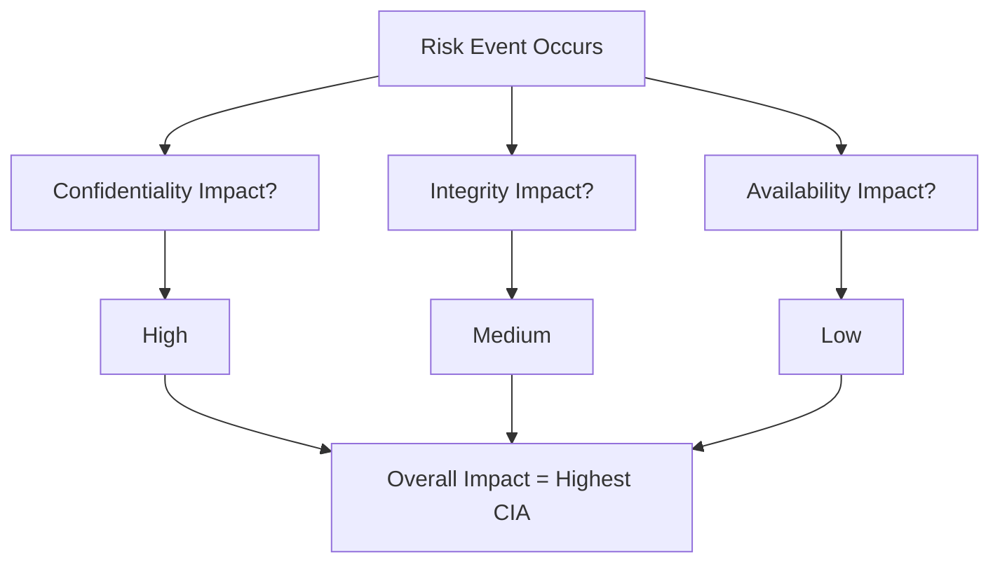
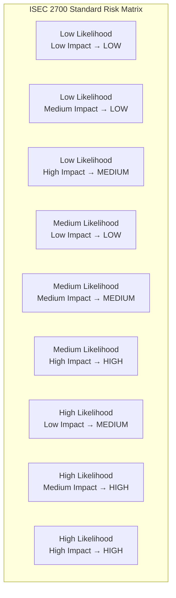
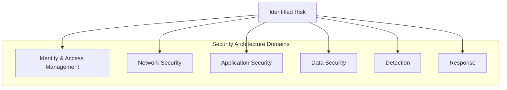
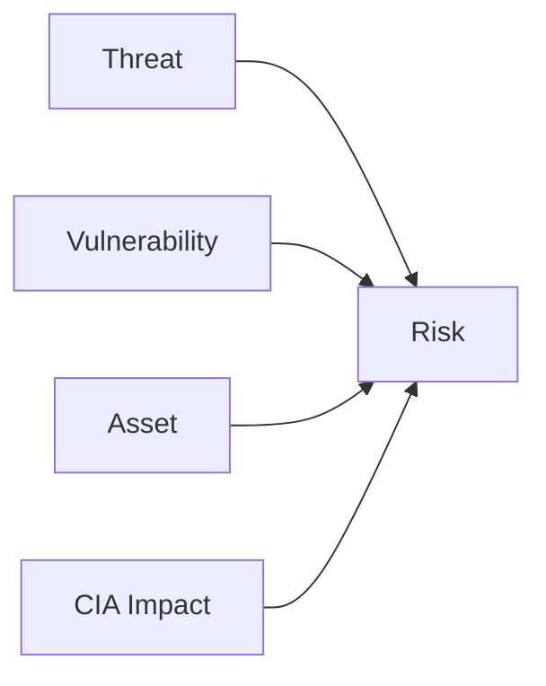
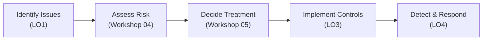

# **Workshop 04 — Risk Assessment Using CIA, Likelihood, and Impact**

**Course:** ISEC 2700 – Introduction to Information Security Practices 
**Workshop Type:** Hands-On (Assessed Workshop) 
**Estimated Time:** 1–1.5 hours 
**Weight:** **5% (Workshop Assessment)** 
**Primary Learning Outcome:** **LO2 – Assess information security risks for a small business environment** 
**Case Study:** **Windows Domain & File/Storage Services (OSYS2020 context)** 

---

## 1. Assignment Details

| Field             | Information                                                                                  |
| ----------------- | -------------------------------------------------------------------------------------------- |
| Workshop Title    | Workshop 04 — Risk Assessment Using CIA, Likelihood, and Impact                              |
| Delivery Mode     | In-class / Guided Lab                                                                        |
| Prerequisites     | Workshops 01–03 (Security Architecture Model, CIA, threats & vulnerabilities)                |
| Tools / Resources | **Workshop 04 Risk Assessment Template (v2)**, **ISEC 2700 Standard Risk Assessment Matrix** |
| Submission        | Completed Risk Assessment Document (DOCX or PDF)                                             |

---

## 2. Overview, Purpose, and Objectives

### Overview

In this workshop, you will learn how security professionals **assess risk** using a **defined, repeatable model**.

Instead of listing problems or jumping to controls, you will:

* analyze **likelihood vs impact**,
* apply **CIA-based impact analysis**,
* and interpret a **standard risk matrix** to determine priorities.

You will apply this process to a **Windows Domain environment** providing authentication and file services.

---

### Purpose (Why this matters)

Organizations do not secure everything equally.

They must decide:

* what is most likely to go wrong,
* what would cause the most damage,
* and what must be addressed first.

Risk assessment provides the **evidence** for those decisions.

---

### Objectives

By the end of this workshop, you will be able to:

1. Explain the difference between **threats, vulnerabilities, and risk**.
2. Assess **likelihood vs impact** using a standardized model.
3. Apply **CIA** to evaluate business impact.
4. Populate and interpret a **risk matrix**.
5. Produce a **professional risk assessment artifact** used in later workshops.

---

## 3. Learning Outcome Alignment

### **LO2 — Assess information security risks**

You will demonstrate your ability to:

* analyze identified issues,
* justify likelihood and impact ratings,
* interpret a risk matrix to support decision-making.

---

## 4. Case Study Context — Windows Domain & File Services

### Reference Environment

* **Active Directory Domain Services (AD DS)**
* **DNS and DHCP**
* **File Server (SMB + NTFS permissions)**
* Windows 11 domain-joined clients
* Staff, student, and administrator accounts

> ⚠️ You are **not fixing systems today**.
> You are assessing the **current state only**.

---

# 5. Instructional Planning Flow

## A) Introduction (Hook)

A department reports:

* users cannot access shared folders,
* files appear missing or locked,
* an administrator account logged in after hours.

Management asks:

> *“How serious is this — and what should we fix first?”*

That question is **risk assessment**.

---

## B) Assessment of Understanding (Quick Diagnostic)

Answer briefly:

1. What is the difference between a **vulnerability** and **risk**?
2. Can a **low-likelihood** event still be high risk? Why?
3. Which CIA pillar is most critical for file services?

---

## C) Core Concepts (Required Background Knowledge)

### 6.1 Risk Is a Combination (Not a Single Thing)

A risk exists only when **four elements intersect**.

> If any one element is missing, you do not have a real risk.

---

### 6.2 Likelihood vs Impact (They Are Not the Same)

* **Likelihood** asks: *How probable is this today?*
* **Impact** asks: *If it happens, how bad is it?*

Low likelihood does **not** mean low priority.

---

### 6.3 CIA Is a Lens, Not an Average

> Always plan for the **worst credible CIA impact**.

---

### 6.4 Standard Risk Matrix (Required Model)

> This matrix is **policy**, not opinion.

---

### 6.5 Master Security Architecture + Risk Map (Semester Anchor)

You will use this model:

* today (risk assessment),
* next workshop (mitigation & policy),
* later (implementation, detection, response).

---

## D) Workshop Tasks

---

### **Task 1 — Document the Current System State**

Describe:

* domain services,
* user types,
* file/data sensitivity,
* business reliance.

**Deliverable:** System Overview section completed.

---

### **Task 2 — Identify 6–8 Domain Risks**

Identify realistic risks (do not copy blindly):

* Excessive domain admin privileges
* Weak password or lockout policy
* Over-permissive file shares
* No tested backups
* Single domain controller (SPOF)

For each risk:

* assign an ID,
* identify the architecture domain,
* note affected CIA pillar(s).

**Deliverable:** Risk Identification table.

---

### **Task 3 — Assess Likelihood**

Using the **standard likelihood scale**, rate each risk:

* Low / Medium / High

Justify each rating using:

* exposure,
* existing controls,
* user behaviour.

---

### **Task 4 — Assess Impact Using CIA**

For each risk:

* evaluate C, I, and A,
* select the **highest applicable impact**,
* justify in business terms.

---

### **Task 5 — Populate and Interpret the Risk Matrix**

* Determine overall risk level,
* Identify the **top three risks**.

Answer:

* Which risks demand action?
* Which could be temporarily tolerated?

---

### **Task 6 — Visual Risk Mapping (Mermaid Activity)**

Choose **one of your risks** and complete the diagram below.

Replace each box with your **actual risk components**.

**Deliverable:** Screenshot or Mermaid code.

---

### **Task 7 — Executive Summary (Management View)**

Write **150–200 words** answering:

* overall risk posture,
* dominant risk themes,
* what must be addressed first.

---

## E) Re-Assessment (Peer Check)

Review another team’s work:

* Are scores derived from the matrix?
* Is CIA applied correctly?
* Are priorities defensible?

Provide one written improvement suggestion.

---

## F) Closure and Transition (3–2–1)

* **3** risks you would address first
* **2** assumptions you made
* **1** risk needing more data

---

## 8. Deliverables

Submit **one completed Risk Assessment Document** containing:

1. System overview
2. Risk identification (6–8 risks)
3. Likelihood assessment
4. CIA-based impact analysis
5. Risk matrix & priorities
6. Visual risk diagram
7. Executive summary

---

## 9. Assessment Criteria (Skills-Based)

| Criteria                   | Evidence of Mastery          |
| -------------------------- | ---------------------------- |
| Risk identification        | Realistic, domain-aligned    |
| Likelihood reasoning       | Uses standard scale          |
| Impact analysis            | CIA applied correctly        |
| Risk matrix                | Priorities derived correctly |
| Visual reasoning           | Mermaid diagram accurate     |
| Professional communication | Clear, management-ready      |

---

## 10. Why This Workshop Matters

